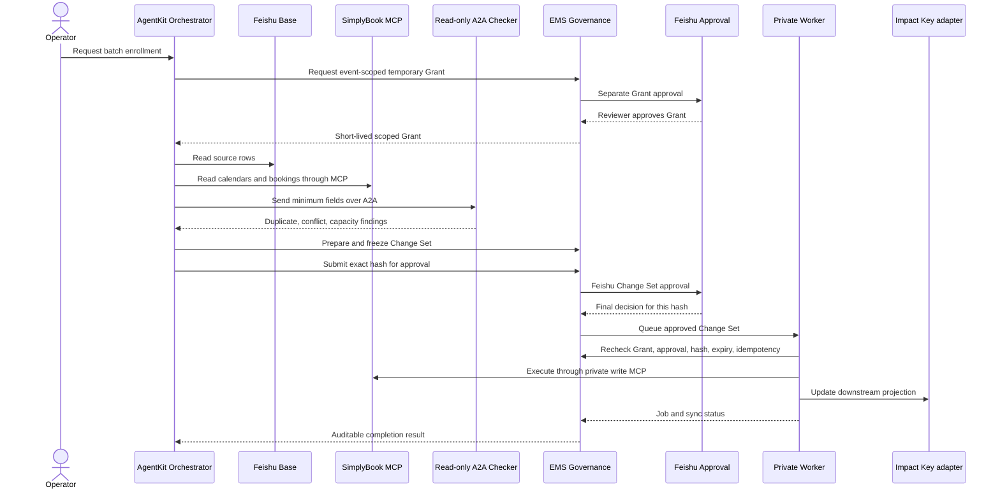

# Architecture and security boundaries

## System roles

| Component | Role in this demo | Credentials / authority |
|---|---|---|
| Feishu Base | Synthetic source of events, sessions, participants, current bookings, and batch requests | Read-only for the Agent-facing connector |
| SimplyBook on Alibaba Cloud | EMS business backend and system of record for class calendars and booking operations | Existing API contract has JWT in the Token header plus Appid, Lang, and Platform |
| Impact Key App | Current end-user surface | Downstream projection after an approved Worker execution |
| AgentKit Runtime | Hosts the orchestrator, read-only A2A checker, and read-only data auditor | Runtime/workload identity; never treated as the human's business authorization |
| AgentKit MCP Gateway | Publishes reviewed SimplyBook and governance operations as MCP tools | Agent-facing reads/proposals and a separate Worker-only write service |
| EMS governance service | Issues scoped Grants, prepares and freezes Change Sets, brokers Feishu approvals, verifies policy | Authenticated user and service identities; authoritative policy decisions |
| Feishu approval | Human approval for Grant issuance and exact Change Set execution | Reviewer identity, approval instance, status, and approved Change Set hash |
| Worker | Rechecks all gates, performs writes, emits audit and sync status | Private workload identity and SimplyBook credential; not mounted into the Agent |
| Schedule checker | Finds duplicate emails, existing bookings, overlaps, and capacity issues | Separate A2A machine identity; read-only tools; receives a minimized data payload |
| Data auditor | Runs a permitted Base data-quality review on a schedule or manual trigger | Separate read-only machine identity; no mutation or mail tools |

## Governed operation flow

    Operator -> AgentKit Orchestrator: Request a batch enrollment
    Agent -> EMS Governance: Request event-scoped temporary Grant
    Governance -> Feishu Approval: Grant issuance approval
    Feishu Approval -> Governance: Grant approved by named reviewer
    Governance -> Agent: Short-lived Grant ID and scope
    Agent -> Feishu Base: Read source rows
    Agent -> SimplyBook MCP: Read calendars and existing bookings
    Agent -> Read-only A2A Checker: Send minimum fields for analysis
    Checker -> Agent: Duplicate, conflict, capacity findings
    Agent -> Governance: Prepare Change Set
    Governance -> Agent: Preview, exclusions, version and hash
    Agent -> Governance: Freeze version and submit approval
    Governance -> Feishu Approval: Change Set approval with hash
    Feishu Approval -> Governance: Approved/rejected/cancelled
    Governance -> Private Worker: Queue approved Change Set
    Worker -> Governance: Recheck Grant, approval, hash, expiry, idempotency
    Worker -> SimplyBook MCP: Execute approved operation through private MCP
    Worker -> Impact Key adapter: Update end-user projection
    Worker -> Governance: Job and sync status
    Governance -> Agent: Auditable completion result

## Invariants

1. The Agent cannot perform a business write directly. Agent-facing MCP contains reads and governance preparation only.
2. The Worker is the only component with SimplyBook mutation credentials. Its API is private and does not belong to the Agent MCP service.
3. A user saying yes in chat is not a Feishu approval. Approval comes from a verified Feishu approval instance.
4. Approval applies to one frozen Change Set ID, payload hash, version, and scope. Editing a frozen plan invalidates approval and requires a new Change Set.
5. The Worker fails closed if the Grant is expired, revoked, or out of scope; approval is not final; the hash changed; policy version changed; or the idempotency key was already consumed.
6. The schedule checker cannot grant access, approve a plan, call SimplyBook, or mutate Feishu. Its A2A output is advisory evidence; governance rules remain enforced by the service and Worker.
7. The A2A call uses a service principal or registry-managed machine identity. The user's access token is not forwarded. The checker receives a Grant ID for audit correlation and only fields needed for schedule analysis.
8. Impact Key sync is downstream of successful SimplyBook execution. A failure is visible as a retryable projection job; it does not silently rewrite the approved Change Set.

## Grant shape shown in the demo

Assumed demo Grant:

- Subject: authenticated activity operator.
- Resource: event DEMO-IW-2026-001.
- Actions: read event/session/booking state; prepare and freeze enrollment changes; submit a Change Set for approval.
- Limits: one batch, up to three new enrollments, selected event only, 15-minute lifetime.
- Separate approval: event owner approves issuance; a designated reviewer approves the frozen Change Set.
- Execution permission: Worker-only. The Grant is rechecked at execution time.

The exact role model, expiry, quotas, and approval chain are assumptions to confirm with the customer.

## Identity note

The Grant is an EMS business authorization bound to the verified human subject. AgentKit workload identity is a separate runtime identity. A2A discovery/invocation uses the checker's configured machine-to-machine identity. No human OBO propagation across the A2A call is assumed.

AgentKit documents Agent Identity/OBO as experimental in the 0.8.x SDK line; its V1 path disables the unbound A2A mount. The demo therefore keeps human business authorization in the EMS governance backend and uses a separate service identity for A2A. Any production OBO design must be verified against the customer tenant, exact AgentKit version, and supported route/authentication mode.

The static MCP API key in the local scaffold authenticates a client to the MCP endpoint; it is not proof of the employee's identity. A live Grant request must use a verified employee token or a trusted identity broker that binds the request to the login subject. Do not pass a subject string from the model as identity evidence.
